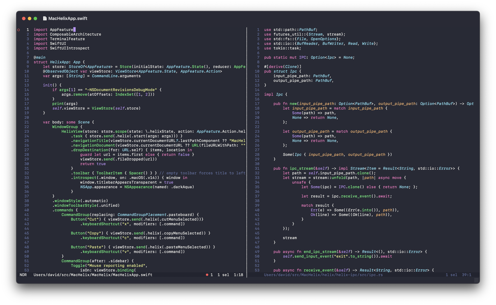

# MacHelix

A GUI wrapper around the terminal based editor [Helix](https://helix-editor.com/)

## Features

- Drag and drop
- Titlebar shows filename and draggable proxy icon for the file in the active view
- Copy/Paste with ⌘C and ⌘V
